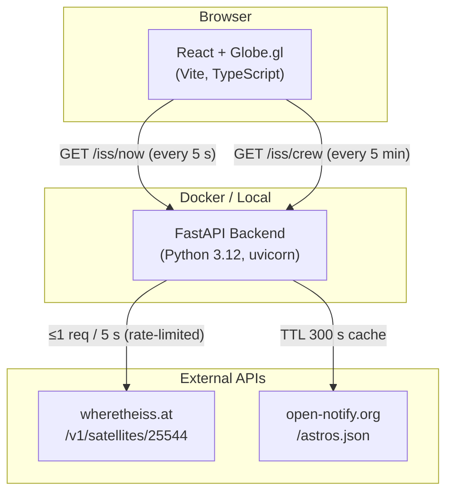
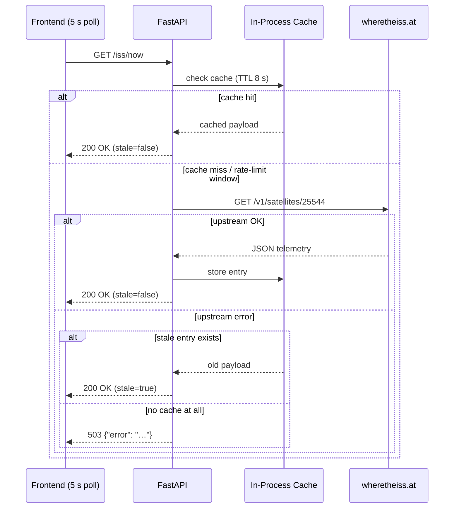
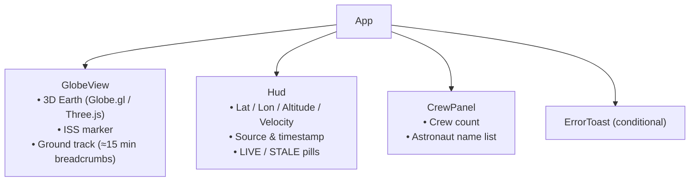

# ISS Live

Real-time International Space Station tracker — a 3D globe dashboard that shows the ISS position, ground track, and current crew. Built with a FastAPI backend and a React + Globe.gl frontend, containerised with Docker Compose, and ready for serverless deployment on AWS.

---

## Architecture

### System Overview



### Backend Request Lifecycle



### Frontend Component Tree



### Serverless Architecture (AWS)

```mermaid
graph LR
    Browser -->|HTTPS| APIGW["API Gateway\nREST API"]
    APIGW -->|proxy| Lambda["Lambda\nPython 3.12\n(serverless_handler.py)"]
    Lambda --> ISS2["wheretheiss.at"]

    subgraph CDK Stack — IssLiveStack
        APIGW
        Lambda
    end
```

---

## Project Layout

```
iss-live/
├── backend/
│   ├── app/
│   │   ├── main.py             # FastAPI app, routes, DI wiring
│   │   ├── iss_client.py       # ISS telemetry client (cache + rate-limit)
│   │   ├── crew_client.py      # Crew client (cache)
│   │   ├── models.py           # Pydantic response models
│   │   ├── config.py           # Settings (pydantic-settings / .env)
│   │   ├── serverless_handler.py  # Mangum adapter for Lambda
│   │   └── tests/
│   ├── Dockerfile
│   ├── pyproject.toml
│   └── requirements.txt
├── frontend/
│   ├── src/
│   │   ├── App.tsx             # Root component, polling loops
│   │   ├── api.ts              # fetch wrappers (fetchIssNow, fetchCrew)
│   │   └── components/
│   │       ├── GlobeView.tsx   # Globe.gl 3D earth + ISS marker + track
│   │       ├── Hud.tsx         # Telemetry overlay
│   │       └── CrewPanel.tsx   # Crew list overlay
│   ├── Dockerfile
│   └── package.json
├── infra/
│   └── lib/iss-live-stack.ts   # AWS CDK — API Gateway + Lambda
├── docker-compose.yml
└── Makefile
```

---

## API Reference

### `GET /health`
```json
{ "ok": true }
```

### `GET /iss/now`
Returns normalised ISS telemetry. Response headers include `Cache-Control: max-age=8` and `Access-Control-Allow-Origin: *`.

```json
{
  "lat": 51.23,
  "lon": -0.45,
  "altitude_km": 421.7,
  "velocity_kmh": 27588,
  "timestamp": "2024-01-15T12:34:56Z",
  "source": "wheretheiss.at",
  "stale": false
}
```

`stale: true` is returned when the upstream is unreachable but a previous value is cached. A `503` is returned only when there is no cached value at all.

### `GET /iss/crew`
Returns ISS crew from open-notify.org, filtered to ISS-only crew members. Cache TTL 300 s.

```json
{
  "count": 7,
  "members": [
    { "name": "Oleg Kononenko", "craft": "ISS" },
    { "name": "Nikolai Chub",   "craft": "ISS" }
  ]
}
```

---

## Prerequisites

| Tool | Version |
|------|---------|
| Docker Desktop | 4.0+ |
| Python | 3.12+ (optional, for local venv) |
| Node.js | 18+ (optional, for local frontend/infra) |

---

## Quick Start (Docker Compose)

```bash
cp backend/.env.example backend/.env
cp frontend/.env.example frontend/.env
make up
```

| Service  | URL |
|----------|-----|
| Frontend | http://localhost:5173 |
| Backend  | http://localhost:8000 |

---

## Make Targets

| Command | Description |
|---------|-------------|
| `make up` | Build and start both services with hot-reload |
| `make down` | Stop and remove the stack |
| `make logs` | Tail combined container logs |
| `make test` | Run `pytest` (backend) + ESLint (frontend) inside containers |
| `make fmt` | Run `ruff` + `black` (backend) and `prettier` (frontend) |

---

## Backend

- **Stack:** FastAPI · httpx · pydantic-settings · uvicorn
- **Caching:** In-process, per-client, monotonic-clock TTL
  - ISS position: 8 s TTL, ≤1 upstream hit per 5 s (rate limit enforced with `asyncio.Lock`)
  - Crew data: 300 s TTL
- **Resilience:** Stale cache served on upstream failure; 503 only when no cache exists
- **Tooling:** `pytest`, `ruff`, `black`

Run tests locally (after creating a virtualenv):

```bash
cd backend
python -m venv .venv && source .venv/bin/activate
pip install -e ".[dev]"
pytest -q
```

---

## Frontend

- **Stack:** Vite · React · TypeScript · Globe.gl (Three.js)
- **Polling:** ISS position every **5 s**, crew every **5 min**
- **Ground track:** last ~15 minutes of positions (180 breadcrumbs at 5 s cadence)
- **HUD:** lat / lon / altitude / velocity / source / timestamp, LIVE / STALE status pills
- **Error state:** toast notification if the local API becomes unreachable; last known coordinates kept on the globe

Quality gates:

```bash
cd frontend
npm run lint        # ESLint
npm run format      # Prettier
npm run typecheck   # tsc --noEmit
npm run build       # production build
```

---

## CI / GitHub Actions

| Workflow | Trigger | Description |
|----------|---------|-------------|
| `claude.yml` | PR opened / updated | Claude PR Assistant reviews and responds to PR comments |
| `claude-code-review.yml` | PR opened / updated | Automated Claude code review on every pull request |

---

## Serverless Deployment (AWS CDK)

The `infra/` directory contains a CDK stack that mirrors the local `/iss/now` endpoint:

- **API Gateway** REST API with open CORS (`GET`, `OPTIONS`)
- **Lambda** (Python 3.12, 512 MB, 10 s timeout) running `backend/app/serverless_handler.py` via Mangum
- Stack output: `IssApiUrl` — the invoke URL for `GET /iss/now`

```bash
cd infra
npm install
npx cdk bootstrap   # one-time per AWS account/region
npx cdk synth       # preview CloudFormation template
npx cdk deploy      # provision API Gateway + Lambda
```

Point the frontend at the deployed URL by setting `VITE_API_URL` in `frontend/.env`.

---

## Troubleshooting

| Symptom | Fix |
|---------|-----|
| CORS errors in browser | Ensure you're calling `http://localhost:8000` (not a different port). The backend already emits `Access-Control-Allow-Origin: *`. |
| Port collisions | Set `BACKEND_PORT` / `FRONTEND_PORT` in your root `.env` before `make up`. |
| Amber **STALE** pill in HUD | The upstream ISS API is unreachable; the backend is serving its most recent cached position. Usually self-resolving. |
| `503` from backend | No cached data and upstream is down. Check connectivity to `api.wheretheiss.at`. |
